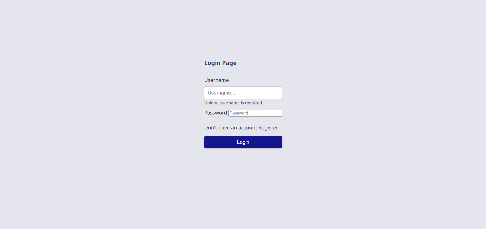
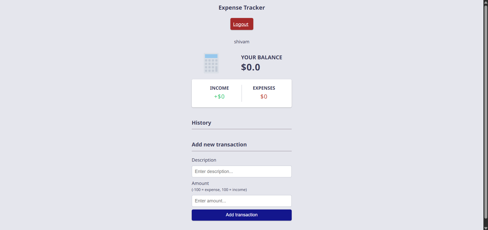
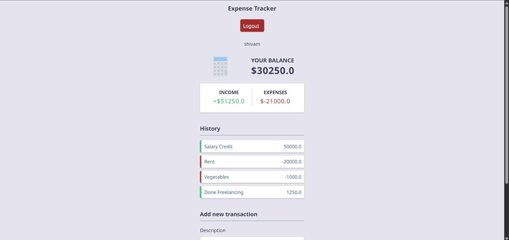

# Expense Tracker (Django)

A full-stack **Expense Tracker** web application built with Django, PostgreSQL, and Bootstrap.  
Users can register, log in, add expenses, view them in a dashboard, and manage their financial records easily.

---

## 🚀 Features
- User authentication (Register/Login/Logout)
- Add, edit, and delete expenses (CRUD)
- Responsive dashboard with Bootstrap
- PostgreSQL database integration
- Environment variable support for secrets

---

## 🛠️ Tech Stack
- **Backend:** Django, Python
- **Frontend:** HTML, CSS, Bootstrap
- **Database:** PostgreSQL
- **Other:** python-decouple (for `.env`), Git

---

## ⚙️ Setup Instructions

### 1. Clone the Repository
```bash
git clone https://github.com/shivam-1403/expense-tracker
cd expense-tracker

```

### 2. Create Virtual Environment
python -m venv env

Activate it:
Windows: env\Scripts\activate
Mac/Linux: source env/bin/activate


### 3. Install Dependencies
pip install -r requirements.txt


### 4. Setup .env

Create a .env file in the project root folder and add:

SECRET_KEY=your_secret_key_here
DB_USER=your_db_username
DB_PASSWORD=your_db_password


### 5. Run Migrations
python manage.py migrate


### 6. Start Server
python manage.py runserver

Open http://localhost:8000 in your browser.

---

# 📂 Project Structure
expense-tracker/

│── expensetracker/       # Main project settings

│── tracker/              # Expense app (models, views, templates)

│── templates/            # HTML templates

│── static/               # CSS/JS

│── .env                  # Environment variables (ignored in Git)

│── requirements.txt      # Project dependencies

│── manage.py             # Django entry point


---

# 🔐 Environment Variables

These must be configured in .env:

SECRET_KEY=your_secret_key_here
DB_USER=your_db_username
DB_PASSWORD=your_db_password

---

# 📸 Screenshots

### Login Page


### Dashboard


### Expense List

---

# 🤝 Contributing

Pull requests are welcome. For major changes, open an issue first to discuss what you would like to change.

---

# 👉 This `README.md` explains:  
- How to run the project  
- How to make their own `.env`  
- Which secrets they must provide  
- What tech stack you used  
